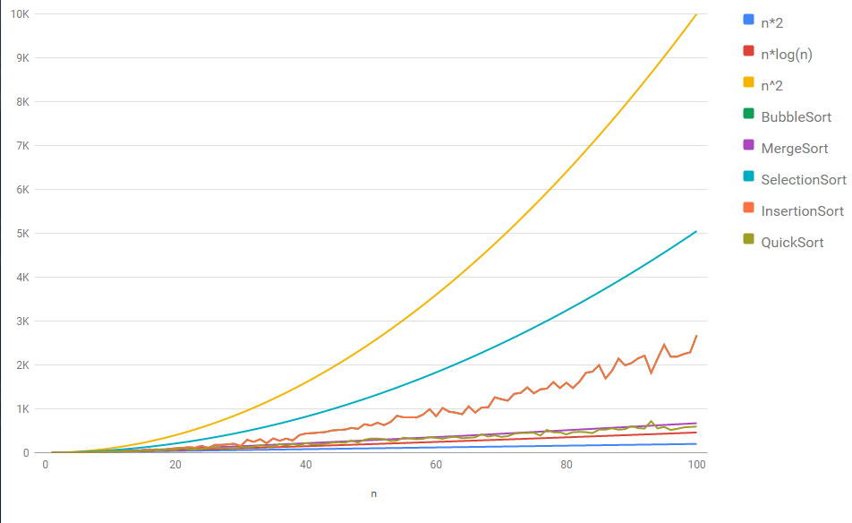

# php-sorting-analysis

Implement popular sorting algorithms in PHP and compare their performance.

## Usage
1. Clone the repository `$ git clone https://github.com/tbence94/php-sorting-analysis.git`
2. Install composer dependencies. `$ composer install`
3. Run `$ php index.php` in project root to see results

## Testing
1. Run `$ phpunit` in project root to run tests.

## External sources
* [PHP](http://php.net)
* [Travis](http://travis-ci.org)
* [Composer](https://getcomposer.org/)
* [PHPUnit](https://phpunit.de/)
* [PSR-2 Coding Style Guide](http://www.php-fig.org/psr/psr-2/)
* [PSR-4 Autoloading](http://www.php-fig.org/psr/psr-4/)